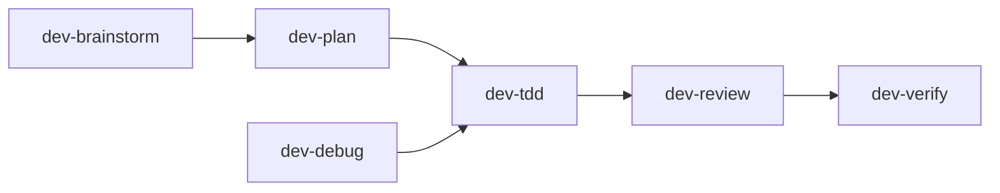

# Development Skills

Generic software development workflow skills for planning, implementation, debugging, review, and verification.

These skills are intentionally language- and framework-neutral. They define the engineering process; project, language, framework, and organization-specific skills should provide technical details when needed.

## Layout

```text
.
├── .claude-plugin/plugin.json
├── .codex-plugin/plugin.json
├── commands/
│   ├── brainstorm.md
│   ├── debug.md
│   ├── dev-cycle.md
│   ├── dev-review.md
│   ├── plan.md
│   ├── tdd.md
│   └── verify.md
└── skills/
    ├── dev-brainstorm/
    ├── dev-debug/
    ├── dev-plan/
    ├── dev-review/
    ├── dev-tdd/
    └── dev-verify/
```

## Skill Flow



| Skill | Use When | Owns |
|---|---|---|
| `dev-brainstorm` | Idea, feature, refactor, architecture, or unclear request | Intent, decisions, alternatives, approved design |
| `dev-plan` | Approved design/spec needs executable tasks | File map, task breakdown, test/review gates |
| `dev-tdd` | Implementing behavior or fixing bugs | Red-green-refactor and changed-line discipline |
| `dev-debug` | Failure or root cause is unknown | Reproduction, hypothesis, tracing, regression test setup |
| `dev-review` | Reviewing diffs, PRs, or generated code | Findings, changed-line scrutiny, system-level review |
| `dev-verify` | Work is nearly done | Evidence, final diff check, requirement coverage, residual risk |

## Principles

- Inspect repo context before asking the user.
- Ask one focused question at a time when decisions are unclear.
- Use tables, bullets, and diagrams for clarity.
- Prefer the smallest useful, testable increment.
- Question every changed line and also step back to review the whole system.
- Keep core skills generic; defer stack-specific rules to separate skills.

## Suggested Usage

- New feature: `dev-brainstorm` -> `dev-plan` -> `dev-tdd` -> `dev-review` -> `dev-verify`
- Bug: `dev-debug` -> `dev-tdd` -> `dev-review` -> `dev-verify`
- Existing PR/diff: `dev-review` -> `dev-verify`
- Small clear change: quick pass through `dev-brainstorm`, then `dev-tdd` or direct implementation with explicit verification if the user approves.

## Slash Commands

| Command | Uses | Purpose |
|---|---|---|
| `/brainstorm` | `dev-brainstorm` | Clarify an idea and produce an approved design |
| `/plan` | `dev-plan` | Turn a clear requirement into executable tasks |
| `/tdd` | `dev-tdd` | Implement one behavior with red-green-refactor |
| `/debug` | `dev-debug` | Diagnose unknown root cause |
| `/dev-review` | `dev-review` | Review a diff or PR without colliding with Claude's built-in `/review` |
| `/verify` | `dev-verify` | Prove work is complete |
| `/dev-cycle` | all workflow skills | Run the full development workflow |

## Claude Code

Claude Code can use the plugin layout directly when installed as a plugin. For manual personal installation, copy the skill folders to:

```text
~/.claude/skills/
```

For manual project installation, copy the skill folders to:

```text
.claude/skills/
```

Claude slash commands can be copied from `commands/` into:

```text
~/.claude/commands/
```

or:

```text
.claude/commands/
```

## Codex

Codex can use this as a plugin through `.codex-plugin/plugin.json`. The individual skill folders include `agents/openai.yaml` metadata for Codex/OpenAI UI surfaces.
