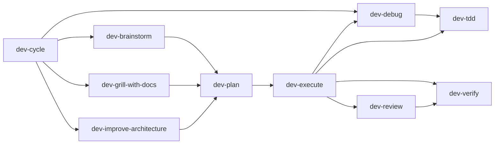

# Development Skills

Generic software development workflow skills for design, planning, execution, debugging, review, verification, architecture improvement, workflow support, and skill authoring.

These skills are intentionally language- and framework-neutral. They define the engineering process; project, language, framework, and organization-specific skills should provide technical details when needed.

## Layout

```text
.
├── .claude-plugin/plugin.json
├── .codex-plugin/plugin.json
├── commands/
│   ├── dev-brainstorm.md
│   ├── dev-cycle.md
│   ├── dev-debug.md
│   ├── dev-execute.md
│   ├── dev-grill-with-docs.md
│   ├── dev-handoff.md
│   ├── dev-improve-architecture.md
│   ├── dev-parallel.md
│   ├── dev-plan.md
│   ├── dev-review.md
│   ├── dev-setup.md
│   ├── dev-tdd.md
│   ├── dev-verify.md
│   ├── dev-worktree.md
│   ├── dev-write-skill.md
│   └── dev-zoom-out.md
└── skills/
    ├── dev-brainstorm/
    ├── dev-cycle/
    ├── dev-debug/
    ├── dev-execute/
    ├── dev-grill-with-docs/
    ├── dev-handoff/
    ├── dev-improve-architecture/
    ├── dev-parallel/
    ├── dev-plan/
    ├── dev-review/
    ├── dev-setup/
    ├── dev-tdd/
    ├── dev-verify/
    ├── dev-worktree/
    ├── dev-write-skill/
    └── dev-zoom-out/
```

## Skill Flow



| Skill | Use When | Owns |
|---|---|---|
| `dev-brainstorm` | A change request needs a design before planning | Goal, scope, alternatives, approved design |
| `dev-grill-with-docs` | A design needs sharper questioning and shared-language maintenance | Decision-by-decision grilling, lazy glossary and ADR updates |
| `dev-plan` | An approved design needs executable tasks | Task slices, file impact, review gates, verification plan |
| `dev-execute` | An approved plan should be carried through to completion | Task orchestration, routing into debug/TDD/review/verify |
| `dev-debug` | A failure is real but the cause is unknown | Reproduction, minimization, hypotheses, diagnosis |
| `dev-tdd` | A behavior slice or diagnosed fix should be implemented | Red-green-refactor implementation discipline |
| `dev-review` | Changed code needs correctness and risk review | Findings ordered by severity |
| `dev-verify` | Work is nearly done and needs proof | Requirement coverage, evidence, residual risk |
| `dev-cycle` | The whole workflow should be handled end to end | Top-level routing and completion control |
| `dev-zoom-out` | A code area needs wider system context | Higher-level code map and flow explanation |
| `dev-handoff` | Work must continue in another session or by another agent | Concise continuation summary |
| `dev-setup` | Workflow doc and artifact conventions need to be clarified | Lightweight setup of persistent conventions |
| `dev-improve-architecture` | The codebase needs structural improvement candidates | Architecture friction analysis and improvement direction |
| `dev-parallel` | Independent work can be split safely across subagents | Parallel task dispatch and consolidation |
| `dev-worktree` | Isolated workspace setup is desired before execution | Workspace isolation decision and handoff |
| `dev-write-skill` | This repository's skill system needs a new or revised skill | Skill authoring, layout, naming, catalog alignment |

## Principles

- Inspect repo context before asking the user.
- Ask one focused question at a time when decisions are unclear.
- Prefer the smallest useful, testable increment.
- Question every changed line and also step back to review the whole system.
- Keep the main workflow skills composable and explicit about handoffs.
- Keep the skills generic; defer stack-specific rules to separate skills.

## Suggested Usage

- Full workflow: `dev-cycle`
- New feature or refactor: `dev-brainstorm` -> `dev-plan` -> `dev-execute`
- Doc-aware design work: `dev-grill-with-docs` -> `dev-plan` -> `dev-execute`
- Bug with unknown cause: `dev-debug` -> `dev-tdd` -> `dev-review` -> `dev-verify`
- Single known implementation slice: `dev-tdd`
- Architecture improvement: `dev-improve-architecture` -> `dev-plan` -> `dev-execute`
- Skill maintenance for this repo: `dev-write-skill`

## Slash Commands

| Command | Uses | Purpose |
|---|---|---|
| `/dev-brainstorm` | `dev-brainstorm` | Turn a rough request into an approved design |
| `/dev-grill-with-docs` | `dev-grill-with-docs` | Interrogate a design while maintaining durable design memory |
| `/dev-plan` | `dev-plan` | Turn an approved design into executable tasks |
| `/dev-execute` | `dev-execute` | Carry an approved plan through implementation, review, and verification |
| `/dev-debug` | `dev-debug` | Diagnose an unknown failure before fixing it |
| `/dev-tdd` | `dev-tdd` | Implement one behavior slice with red-green-refactor |
| `/dev-review` | `dev-review` | Review a diff or PR without colliding with Claude's built-in `/review` |
| `/dev-verify` | `dev-verify` | Prove completed work matches intent |
| `/dev-cycle` | `dev-cycle` | Run the full development workflow |
| `/dev-zoom-out` | `dev-zoom-out` | Explain a code area in wider system context |
| `/dev-handoff` | `dev-handoff` | Package the current state for another session or agent |
| `/dev-setup` | `dev-setup` | Establish lightweight workflow conventions |
| `/dev-improve-architecture` | `dev-improve-architecture` | Surface concrete architecture improvements |
| `/dev-parallel` | `dev-parallel` | Split independent work across parallel subagents |
| `/dev-worktree` | `dev-worktree` | Set up or confirm an isolated workspace |
| `/dev-write-skill` | `dev-write-skill` | Create or revise a skill in this repository |

## Claude Code

Claude Code can use the plugin layout directly when installed as a plugin. For manual personal installation, copy the skill folders to:

```text
~/.claude/skills/
```

For manual project installation, copy the skill folders to:

```text
.claude/skills/
```

Claude slash commands can be copied from `commands/` into:

```text
~/.claude/commands/
```

or:

```text
.claude/commands/
```

## Codex

Codex can use this as a plugin through `.codex-plugin/plugin.json`. The individual skill folders include `agents/openai.yaml` metadata for Codex/OpenAI UI surfaces.
