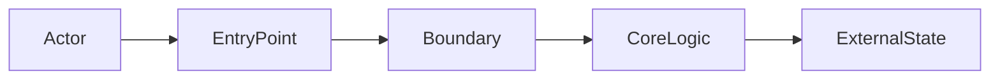
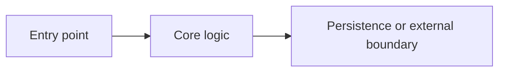

# Dev Brainstorm

## Overview

Turn a rough development request into a shared, implementation-ready design before code changes begin. Combine a codebase-first discovery pass with a focused "grill me" interview: ask only the questions that cannot be answered from the repo, one at a time, and include a recommended answer with each question.

This skill owns the planning conversation, not implementation. Do not write production code, scaffold a project, or invoke implementation workflows until the user has approved the design or explicitly asked to skip brainstorming.

## Core Rules

- Inspect before asking. If a question can be answered by reading project files, docs, tests, recent commits, or existing conventions, inspect those sources instead of asking the user.
- Ask one question at a time. Do not bundle multiple decisions into one message unless the user explicitly asks for a checklist.
- Include your recommended answer. Every question should say what you recommend and why, so the user can accept, reject, or correct it quickly.
- Walk the decision tree. Resolve upstream decisions before downstream details that depend on them.
- Prefer scannable output. Use bullets, tables, decision matrices, sequence diagrams, flowcharts, component diagrams, or simple ASCII/Mermaid diagrams when they make the design easier to understand.
- Keep the design proportional. Tiny changes may need a short design; ambiguous or cross-cutting work needs a deeper one.
- Stay generic. Do not assume any specific language, framework, platform, or stack. Detect the repo context and defer stack-specific details to repo docs or relevant language/framework skills.
- Stop before implementation. The terminal state is an approved design handoff or a handoff to the next planning/spec skill, not code.

## Standards-Inspired Checks

Use these generic software engineering checks during brainstorming. Keep them lightweight for small work and explicit for larger or riskier work.

- **Requirement quality:** make each important requirement clear, necessary, feasible, verifiable, and traceable to a user, business, operational, or technical need.
- **Working increment:** prefer the smallest useful change that can be built, tested, reviewed, and delivered independently.
- **Simplicity:** remove unnecessary scope, reduce coupling, and choose designs that are easy to explain, test, and change.
- **Acceptance evidence:** define how success will be proven before implementation starts: automated tests, manual checks, observable behavior, metrics, logs, or user acceptance.
- **Security and privacy:** identify trust boundaries, sensitive data, permissions, input validation, abuse cases, dependency risk, and audit/logging needs when relevant.
- **Compatibility and migration:** call out backward compatibility, data migration, versioning, rollout, rollback, and deprecation concerns.
- **Operability:** consider configuration, failure modes, monitoring, error messages, supportability, and reproducible build/test/release steps when the change affects runtime behavior.

## Workflow

### 1. Classify the Request

Choose the lightest path that still prevents misunderstanding:

- **Quick pass:** small, low-risk change with clear intent. Ask at most one clarifying question, then produce a compact design summary.
- **Standard pass:** normal feature, behavior change, refactor, or bug-fix plan. Use the full workflow.
- **Deep pass:** ambiguous, cross-system, domain-heavy, user-facing, security-sensitive, data-model, migration, or architecture work. Spend more time on context, alternatives, risks, and staged rollout.

If the user explicitly asks to skip brainstorming, acknowledge the risk briefly and continue according to their instruction.

If this skill triggers during an otherwise straightforward implementation request, use the quick pass. Do not force a long planning ceremony when the intent, scope, and verification path are already clear.

### 2. Explore Context First

Before questioning the user, inspect available context:

- Existing repository instructions such as `AGENTS.md`, `CLAUDE.md`, `GEMINI.md`, `.cursor/rules`, or project docs.
- Product/domain docs such as `README.md`, `CONTEXT.md`, `docs/`, ADRs, issue templates, or specs.
- Source and tests near the requested area.
- Build and test configuration that reveals language, framework, package manager, and conventions.
- Recent commits if they help explain the current direction.

Summarize only the context that matters for the design. Do not dump file contents or produce a long repository tour.

If repo context is missing or too thin to answer product, domain, workflow, API, UX, or acceptance questions, ask the user for source material before continuing unless the change is small enough for a quick pass. Accept whatever form is easiest for them: PDF, DOCX, Markdown, screenshots, tickets, issue links, design links, API docs, pasted notes, meeting notes, or existing specs.

Ask for the smallest useful artifact set:

```markdown
I do not see enough project context to design this confidently.

Please upload or point me to any relevant docs, such as requirements, PDFs, tickets, screenshots, API docs, or existing specs.

Recommendation: provide the primary requirement/source-of-truth first; I can ask for more only if the design still has gaps.
```

When the user provides documents, extract only the planning-relevant facts and cite the artifact names in the design summary. If the user wants the context preserved in the project, ask before copying or summarizing it into a durable location. Prefer the repo's existing docs location; otherwise use:

```text
docs/dev/context/
```

Do not persist sensitive, proprietary, personal, or third-party materials into the repository unless the user explicitly approves.

### 3. Interview One Decision at a Time

Ask focused questions until the design is no longer ambiguous. Each question should use this shape:

```markdown
Question: [one decision to resolve]

Recommendation: [your recommended answer]

Why: [short reasoning based on goals, codebase context, risk, or simplicity]
```

Prefer multiple-choice questions when it helps the user answer quickly, but do not force choices when the real answer is open-ended.

Good question areas:

- User goal and success criteria.
- Non-goals and scope boundaries.
- Existing behavior that must stay unchanged.
- API, data, state, and integration boundaries.
- Error handling, empty states, permissions, security, privacy, and observability.
- Rollout, migration, compatibility, and rollback concerns.
- Testing strategy and acceptance checks.

### 4. Propose Alternatives

Once the important decisions are known, present 2-3 viable approaches when there is a meaningful design choice. Lead with the recommended approach.

Prefer a table when comparing approaches:

```markdown
| Approach | Fit | Trade-offs | Recommendation |
|---|---|---|---|
| A. [name] | [where it fits] | [costs/risks] | Recommended because [reason] |
| B. [name] | [where it fits] | [costs/risks] | Use only if [condition] |
```

Use this shorter format when a table would be heavier than the decision:

```markdown
Recommended: [Approach A]
[Why this is the best fit.]

Alternative: [Approach B]
[Trade-off.]

Alternative: [Approach C]
[Trade-off, if useful.]
```

Do not invent alternatives just to satisfy a format. If there is only one sensible path, say so and explain why.

### 5. Present the Design for Approval

Present the proposed design in sections scaled to complexity:

- **Goal:** what the change achieves.
- **Scope:** what is included and excluded.
- **User/API behavior:** externally visible behavior.
- **Architecture:** components, boundaries, data flow, and dependencies.
- **Edge cases:** errors, empty states, race conditions, permissions, and compatibility.
- **Testing:** behavior tests, regression tests, integration checks, and manual verification.
- **Delivery:** rollout, migration, rollback, and operational checks when relevant.
- **Risks:** likely failure modes and mitigations.

Use tables for dense comparisons, decisions, risk registers, acceptance criteria, and open questions. Use diagrams when explaining architecture, data flow, request flow, state transitions, or rollout sequencing. Mermaid is preferred when supported; otherwise use ASCII.

Useful diagram shapes:



```mermaid
sequenceDiagram
  participant Actor
  participant EntryPoint
  participant Boundary
  Actor->>EntryPoint: Trigger behavior
  EntryPoint->>Boundary: Request work
  Boundary-->>EntryPoint: Result or error
```

For larger designs, pause after major sections and ask whether that section looks right before continuing. For smaller designs, present the whole design and ask for approval in one message.

### 6. Produce the Handoff

After the user approves, produce an implementation handoff. If a separate planning/spec skill exists, invoke or recommend it next. Otherwise, write a concise handoff in the conversation with:

````markdown
Approved Design

Goal:
- [observable outcome]

Scope:
- Included: [in-scope work]
- Excluded: [out-of-scope work]

Key Decisions:
| Decision | Choice | Reason |
|---|---|---|
| [decision] | [choice] | [reason] |

Architecture / Flow:


Implementation Notes:
- [important implementation constraints or sequencing]

Testing Strategy:
| Check | Evidence |
|---|---|
| [behavior] | [test/manual check/metric] |

Open Questions:
- [none, or specific remaining decision]
````

If the repo already has a specs directory or the user has requested durable docs, write the approved design to the project's existing spec location. If no convention exists, use:

```text
docs/dev/specs/YYYY-MM-DD--short-name.md
```

Only create files after the user has approved the design or explicitly asked for a written spec.

## Composition With Other Skills

Use this as the front door for development planning. Let other skills own their narrower areas:

- Language diagnostics skills own stack-specific testing and debugging details.
- Framework skills own frontend service, backend service, UI framework, database, or cloud conventions.
- TDD skills own test-first implementation after the design is approved.
- Review and verification skills own changed-code inspection and final checks after implementation.

When multiple skills apply, this skill resolves what should be built; technical/domain skills help determine how it should be built.

## Anti-Patterns

- Asking the user to explain facts that are visible in the repository.
- Asking several unrelated questions at once.
- Coding before design approval.
- Treating a vague request as clear because implementation seems easy.
- Turning every tiny request into a long ceremony.
- Baking language, framework, organization-specific, or project-specific rules into the generic brainstorming flow.
- Producing a design that has no testing or verification strategy.
