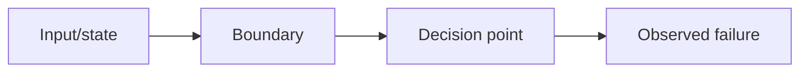

# Dev Debug

## Overview

Debug by evidence, not guessing. Reproduce the failure, minimize it, form hypotheses, inspect the relevant code line by line, identify the root cause, add a regression test, then fix the smallest responsible behavior.

This skill diagnoses and prepares the fix. Use `dev-tdd` for the fix implementation and `dev-verify` for final proof.

## Core Rules

- Reproduce before fixing. If reproduction is impossible, define the best available evidence and uncertainty.
- Keep a hypothesis table. Do not chase random changes.
- Inspect both the failing line and the system around it: inputs, state, dependencies, timing, contracts, and recent changes.
- Prefer instrumentation and targeted tests over broad rewrites.
- Fix root cause, not just the symptom.
- Add or update a regression test whenever practical.
- Stay generic. Detect stack/tooling from the repo.

## Workflow

### 1. Capture the Symptom

Create a concise incident table:

| Field | Details |
|---|---|
| Observed behavior | [what happens] |
| Expected behavior | [what should happen] |
| Scope | local / test / staging / production / unknown |
| Frequency | always / intermittent / data-specific / unknown |
| First known bad | [commit/time/version if known] |
| Evidence | logs, stack traces, screenshots, test output |

If evidence is missing, ask for the smallest useful artifact: failing command, logs, screenshot, input data, or reproduction steps.

### 2. Reproduce and Minimize

Find the shortest feedback loop:

| Reproduction path | Command/input | Expected failure |
|---|---|---|
| targeted test | `[command]` | [failure] |
| local action | [steps] | [failure] |
| log/query inspection | [source] | [signal] |

Reduce the case until it isolates the behavior:

- Smaller input.
- Narrower test.
- Single endpoint/component/function when possible.
- Controlled data and configuration.

Do not edit production code until the failure is understood or the user approves exploratory changes.

### 3. Build Hypotheses

Use a table:

| Hypothesis | Evidence for | Evidence against | Next check |
|---|---|---|---|
| [possible cause] | [signal] | [counter-signal] | [specific command/read/instrumentation] |

Prioritize hypotheses that explain all observed facts with the fewest assumptions.

### 4. Trace the Root Cause

Inspect the path from input to failure:

At each changed or suspicious line, ask:

- What assumption does this line make?
- What input/state violates that assumption?
- Is the failure caused here or only exposed here?
- What test would fail if this line regressed again?
- What upstream/downstream contract depends on it?

Use logs, debugger output, assertions, or temporary instrumentation when reading code is not enough. Remove temporary instrumentation before finishing unless it becomes intentional observability.

### 5. Prove the Diagnosis

Before fixing, summarize:

| Root cause | Proof | Regression test idea |
|---|---|---|
| [cause] | [evidence] | [test/check] |

If multiple plausible causes remain, continue narrowing. Do not patch based on vibes.

### 6. Fix With TDD

Hand off to `dev-tdd`:

- Write the regression test first.
- Confirm it fails for the diagnosed reason.
- Implement the minimal root-cause fix.
- Confirm the regression test and nearby tests pass.

### 7. Verify the Fix

After implementation:

| Verification | Evidence |
|---|---|
| Original reproduction no longer fails | [command/output] |
| Regression test passes | [command/output] |
| Nearby behavior unaffected | [tests/manual check] |
| Root cause explanation matches diff | yes/no |

Use `dev-review` for code inspection and `dev-verify` for completion proof.

## Anti-Patterns

- Fixing before reproducing.
- Changing multiple variables at once.
- Treating stack trace location as root cause without tracing inputs.
- Adding broad retries, sleeps, or null checks without explaining why they are correct.
- Removing failing tests instead of understanding them.
- Stopping at "works now" without regression coverage or documented evidence.
