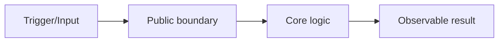

# Dev Plan

## Overview

Turn an approved intent into an executable plan that a competent engineer or agent can follow without guessing. The plan should connect every task to user-visible behavior, affected files, tests, review checks, and final verification.

This skill plans implementation; it does not write production code.

## Core Rules

- Start from an approved design, spec, bug diagnosis, or clear requirement. If intent is still ambiguous, hand back to `dev-brainstorm`.
- Inspect the repository before planning. Use existing architecture, tests, commands, naming, and file organization.
- Prefer the smallest independently verifiable increments.
- Make every task evidence-driven: test, build, lint, typecheck, manual check, metric, or observable behavior.
- Plan line-level scrutiny and big-picture review. Each task should say what changed lines must prove and what system contract they affect.
- Stay generic. Detect stack/tooling from the repo; defer stack-specific details to language/framework skills.
- Use bullets, tables, and diagrams for clarity. Avoid paragraph-heavy plans.

## Workflow

### 1. Confirm Inputs

Build a short planning context table:

| Input | Source | Status |
|---|---|---|
| Goal | [design/spec/user request] | Clear / unclear |
| Scope | [included/excluded work] | Clear / unclear |
| Constraints | [repo docs/tests/tooling] | Clear / unclear |
| Verification | [tests/checks] | Clear / missing |

If a required input is unclear, ask one focused question with a recommended answer. Do not proceed with a plan that hides ambiguity.

### 2. Map the Existing System

Inspect enough code to understand where the change belongs:

- Entry points, public APIs, UI surfaces, jobs, commands, or integration boundaries.
- Current tests and fixtures near the behavior.
- Data models, persistence, configuration, permissions, and error handling.
- Build/test/lint/typecheck commands available in the repo.

Summarize as a compact map:

| Area | Existing file(s) | Responsibility | Planned impact |
|---|---|---|---|
| [area] | `[path]` | [what it owns] | none / modify / test |

Use a diagram when the change spans components:



### 3. Choose Implementation Shape

Compare meaningful options when there is more than one path:

| Approach | Fit | Risks | Decision |
|---|---|---|---|
| [recommended] | [why it fits] | [main risk] | Use |
| [alternative] | [when it fits] | [trade-off] | Do not use because [reason] |

Prefer designs that are simple, testable through public behavior, easy to review, and reversible.

### 4. Break Into Tasks

Each task should be small enough to review and verify independently.

Task template:

````markdown
### Task N: [Outcome]

**Goal**
- [one observable behavior or structural improvement]

**Files**
| Path | Action | Reason |
|---|---|---|
| `[path]` | create/modify/test | [why this file changes] |

**Line-Level Checks**
| Check | Why it matters |
|---|---|
| Each changed condition proves a named behavior | Prevents accidental branch logic |
| Each new dependency is necessary | Prevents coupling creep |
| Each error path is intentional | Prevents silent failures |

**Steps**
- [ ] Write or update the failing behavior/regression test.
- [ ] Run the targeted test and confirm the expected failure.
- [ ] Implement the smallest change that makes the test pass.
- [ ] Run the targeted test and relevant nearby tests.
- [ ] Review the diff line by line against the task goal.
- [ ] Update docs/types/contracts only if behavior changed.

**Verification**
| Command or check | Expected evidence |
|---|---|
| `[command]` | [pass/fail expectation or observable result] |
````

Use `dev-tdd` for the execution of test-first implementation tasks.

### 5. Add Risk and Review Gates

Every plan should include gates:

| Gate | Required evidence |
|---|---|
| Test-first behavior | failing test observed before implementation |
| Changed-line review | every changed line has a reason tied to behavior, structure, or verification |
| System review | public contracts, data flow, permissions, errors, and compatibility still make sense |
| Final verification | relevant automated/manual checks pass with clean output |

For risky work, add rollout and rollback:

| Risk | Mitigation | Rollback |
|---|---|---|
| [risk] | [guard/test/check] | [how to undo or disable] |

### 6. Produce the Plan

Write the final plan with:

- Goal and scope.
- System map.
- Chosen approach.
- Task list.
- Test strategy.
- Review gates.
- Verification checklist.
- Open questions.

If the user asks for a durable plan or the repo has a plan convention, write it there. Otherwise use:

```text
docs/dev/plans/YYYY-MM-DD--short-name.md
```

Only create a plan file after the user approves or explicitly asks for one.

## Anti-Patterns

- Planning before the goal is understood.
- Hiding uncertainty inside vague tasks.
- Listing files without saying why they change.
- Creating tasks that cannot be tested or reviewed independently.
- Writing implementation code inside the planning phase.
- Assuming stack-specific commands without detecting them from the repo.
