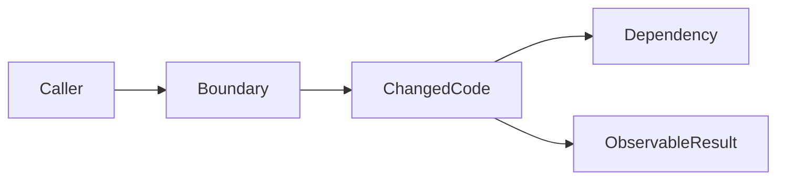

# Dev Review

## Overview

Review like a senior engineer: every changed line must justify itself, and the whole change must still make sense as a system. Lead with concrete findings, not summaries.

This skill reviews; it does not rewrite code unless the user asks for fixes.

## Core Rules

- Review the diff first, then inspect surrounding code needed to understand contracts and risk.
- Question every changed line: is it necessary, correct, tested, named clearly, and consistent with nearby code?
- Step back after line review: does the whole change fit the design, architecture, data flow, and user behavior?
- Prioritize bugs, regressions, missing tests, security/privacy issues, and maintainability risks.
- Cite exact file paths and line numbers when possible.
- Use severity. Critical/blocking issues come first.
- Stay generic. Use repo conventions and relevant language/framework skills for stack-specific review.
- Do not approve based only on tests passing.

## Review Inputs

Collect:

| Input | Source |
|---|---|
| Diff | `git diff`, PR diff, or provided patch |
| Intent | approved design, plan, issue, or user request |
| Verification | test/lint/typecheck/build output if available |
| Context | surrounding code, docs, contracts, recent changes |

If intent is missing, infer cautiously and state the assumption. Ask one question if the review cannot be meaningful without it.

## Review Passes

### 1. Intent and Scope

Check:

- Does the change solve the stated problem?
- Is anything outside scope?
- Are there missing files, migrations, docs, tests, or configs?
- Does the implementation contradict the approved design?

### 2. Changed-Line Review

For each changed block, inspect:

| Line-level question | Risk caught |
|---|---|
| Why does this line need to change? | unnecessary churn |
| What input/state can break it? | correctness bugs |
| What test proves it? | missing coverage |
| What contract depends on it? | compatibility regressions |
| What happens on error/empty/null/timeout? | edge-case failures |
| Does the name/type/API express intent? | maintainability issues |

For generated or repetitive code, sample the pattern and inspect the generator/source of truth if available.

### 3. System-Level Review

Use a compact map for non-trivial changes:



Check:

- Public API, UI, CLI, job, event, or data-contract behavior.
- State transitions and concurrency/timing assumptions.
- Persistence, migrations, versioning, and backward compatibility.
- Permissions, trust boundaries, sensitive data, and input validation.
- Observability, logs, metrics, and useful error messages.
- Rollout/rollback when runtime behavior changes.

### 4. Test Review

| Test question | Expected answer |
|---|---|
| Does a test fail without the implementation? | yes, for behavior changes |
| Does it test public behavior? | yes where practical |
| Does it cover important edge/error paths? | yes for meaningful risk |
| Does it avoid over-mocking? | yes |
| Are manual checks documented when automation is not practical? | yes |

Missing tests are findings when they create regression risk.

### 5. Findings Format

Lead with findings:

```markdown
Findings

| Severity | Location | Issue | Recommendation |
|---|---|---|---|
| Critical/High/Medium/Low | `[file:line]` | [specific problem and impact] | [specific fix or check] |
```

Severity guide:

| Severity | Meaning |
|---|---|
| Critical | data loss, security issue, build break, production outage, severe regression |
| High | likely user-visible bug or broken core workflow |
| Medium | edge-case bug, missing important test, maintainability risk |
| Low | naming, minor clarity, small cleanup |

If no issues are found, say so clearly and list residual risk or unverified checks.

## Anti-Patterns

- Summarizing before findings.
- Reviewing only style while missing behavior.
- Trusting generated code without inspecting changed contracts.
- Reviewing only changed lines and ignoring affected callers.
- Requiring personal preference changes without a correctness or maintainability reason.
- Saying "looks good" without noting what was verified.
